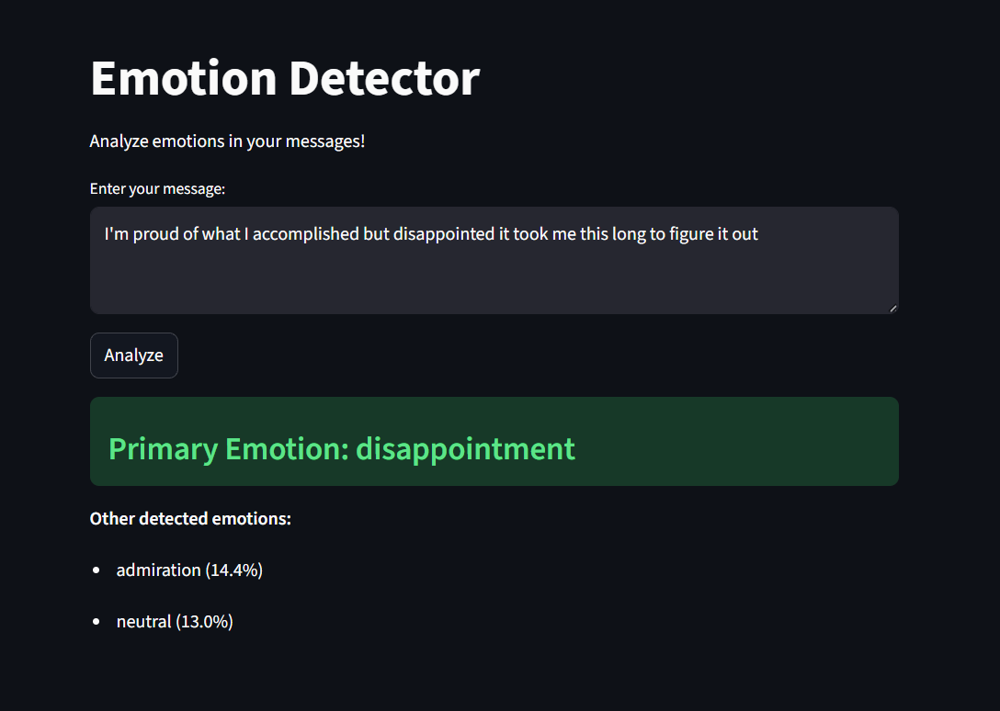

# Emotion Detector 💬

A ML web app that detects emotions in a sequence of texts using Logistic Regression.

## Features
- Detects 28 different emotions dataset
- Shows confidence scores for top emotions
- Built with Streamlit for easy interaction

## Tech Stack
- Python
- Scikit-learn (Logistic Regression, TF-IDF)
- Streamlit
- GoEmotions Dataset

## How to Run
```bash
pip install streamlit scikit-learn pandas
streamlit run app.py
```

## Demo

